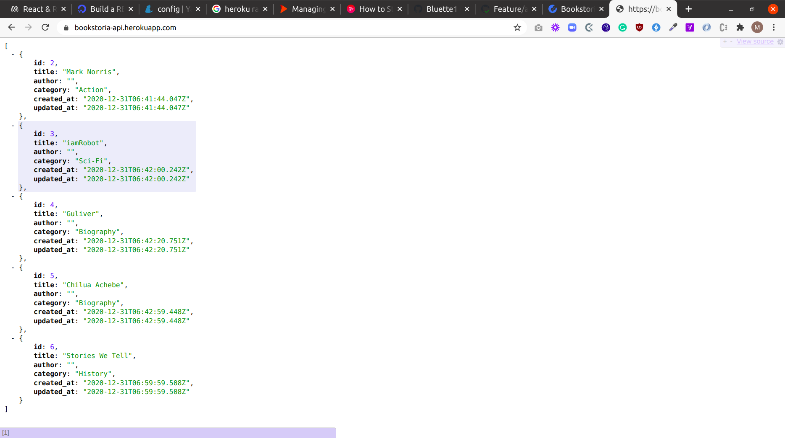

# bookstore-api




## Built With
- Ruby
- Rails 

## Description
- This project is for building a simple RESTful backend API for the bookstore [application](https://bookstoria-mine.herokuapp.com/).

- The Rails framework was used to build this project.

## Live Demo
[Live Demo](https://bookstoria-api.herokuapp.com)

### Run instructions 
-  You can clone the GitHub repo and type the following commands in the terminal to run the app locally 
    ```
    bundle install
    rake db:migrate
    rails server
    ```

### How to use the site
Make sure the server is running
- Go to http://localhost:3000/ in your web browser
- You will be able to access the following routes (among others)
  - http://localhost:3000/books: where you can view the books list.

- Follow the links on the [bookstore site](https://github.com/Bluette1/bookstore) to access the available features.

## Deployment
- You can deploy on [Heroku](https://devcenter.heroku.com/categories/ruby-support).

## Authors

👤 **Marylene Sawyer**
- Github: [@Bluette1](https://github.com/Bluette1)
- Twitter: [@MaryleneSawyer](https://twitter.com/MaryleneSawyer)
- Linkedin: [Marylene Sawyer](https://www.linkedin.com/in/marylene-sawyer)

# Acknowledgements
- [Build a RESTful JSON API With Rails 5 - Part One](https://www.digitalocean.com/community/tutorials/build-a-restful-json-api-with-rails-5-part-one)

## 🤝 Contributing

Contributions, issues and feature requests are welcome!

Feel free to check the [issues page](https://github.com/Bluette1/bookstore-api/issues).

## Show your support

Give a ⭐️ if you like this project!

## 📝 License

This project is [MIT](https://opensource.org/licenses/MIT) licensed.

